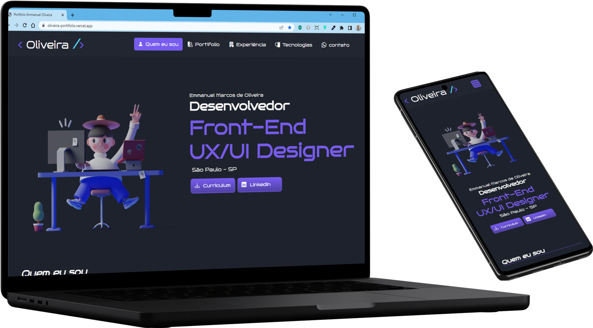

 
 

[Descrição](#--descrição-do-projeto-) |
[Funcionalidades](#%EF%B8%8F-funcionalidades)|
[Como executar esse projeto ?](#%EF%B8%8F-como-executar-esse-projeto-) |
[Referências](#-referências-) |
[Autor](#-autor-) 

 

  

 

 
<h1 text-align="center"> 🌟Portifólio🌟</h1> 

 
 

<h2> ✅ Descrição do Projeto: </h2> 

 

   Esse Projeto foi construído para a prática e divulgação do meu aprendizado. Nele estou aplicando técnicas de  <em>HTML, CSS, e Bootstrap</em> com base em minhas referências do curso de <strong>Full Stack Python</strong> que estou cursando pela <a href="https://ebaconline.com.br/">EBAC</a> E também não poderia deixar de mencionar as técnicas desenvolvidas no curso de<strong> UI para inciantes</strong> da<a href="https://www.origamid.com/">Origamid</a>. Foi gratificante ver que consegui aplicar o que aprendi!😊 

 
 

<h2> Video 📽️ de Demostração do Projeto</h2>

https://github.com/emmanuelmarcosdeoliveira/oliveira-portifolio/assets/116108389/a8c90f6c-c933-4b9e-a8ec-f1f7fa08e4d9

 
 

  <h2>⚙️ Funcionalidades</h2>

 Esse projeto é para divulgação do meu <strong>Portfólio Pessoal.</strong> Nele tem um breve descrição da minha pessoa; um pouco da minha <strong>Experiência Profissional</strong> e alguns dos meus Projetos criados atráves de conhecimentos adquiridos com a <em>EBAC, Origamid e Estudonauta</em>  
 
 

<h2>🪛Tecnologias Utilizadas </h2>

 
 

 <h2>🛣️ Como Executar esse projeto ?</h2>

 
 

 :memo: **Dica:** Clique no link abaixo de website ⬇️

 

 

<h2> 📚Referências </h2>
 

 :memo: **Acesse:** [EBAC](https://ebaconline.com.br/) 
 :memo: **Acesse:** [Origamid](https://origamid.com/)
 
 

 <h2>👨🏻‍🦱 Autor </h2>
<h3> <a href="https://oliveira-portifolio.vercel.app/">Dev-Oliveira</a> </h3>
   
  
   

 
   
&copy; Todos os Direitos Reservados

<h1> 😁Obrigado por chegar até aqui!</h1>

